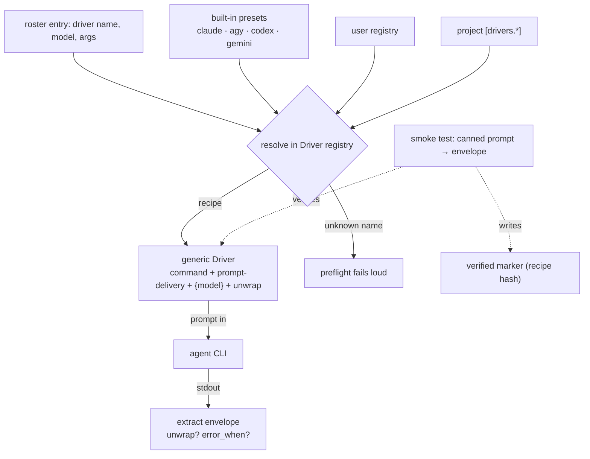

# Open Drivers

## Problem Statement

Adding an agent CLI to giro means editing `drivers.py` and cutting a release — the driver set is four hardcoded Python classes (`claude`, `agy`, `codex`, `gemini`). An operator who runs `cursor-agent`, `aider`, or an in-house tool cannot point giro at it without a code change, so giro only builds with the agents its maintainers foresaw.

## Solution

A **Driver** becomes an open declarative recipe an operator writes in config — or has `giro-setup` write from chat. Any CLI that honours the worker contract (prompt in on stdin or a file, headless, edits its cwd, ends with the JSON envelope) is drivable by name, no release. The four shipped tools stay as built-in presets. A one-shot smoke test proves an arbitrary CLI honours the contract before any Run trusts it.

## User Stories

1. As an operator, I want to define a new agent CLI as a `[drivers.<name>]` recipe, so I can build with a tool giro never shipped support for.
2. As an operator, I want the four built-in agents to keep working with zero config, so upgrading changes nothing for me.
3. As an operator, I want a driver name in the roster resolved across built-in presets, my user-level registry, and the project file (last-wins), so personal tools follow me across repos while a repo can pin its own.
4. As an operator, I want `giro-setup` to propose a recipe for an unknown CLI from its `--help`, confirm the contract with me, and smoke-test it, so defining a driver is a short conversation.
5. As an operator, I want a driver that cannot produce a parseable envelope to fail loudly at definition time, not at attempt 3 of a Run, so a bad recipe never silently burns a budget.
6. As an operator, I want `giro doctor` to tell me which drivers are runnable here and to re-smoke-test one on demand, so I can trust a Run before dispatching it.
7. As a security-conscious operator, I want the write-bypass flag to stay a per-role roster setting, so a judge or planner defined with the same driver never inherits write access.

## Shape



## Implementation Decisions

- A `[drivers.<name>]` recipe is exactly five fields — `command` (argv without prompt or model), `prompt` ∈ {`stdin`, `positional-dash`, `file`}, `model` (a template; `{model}` is substituted; empty = no model flag), optional `unwrap` (a JSON key holding the envelope text), optional `error_when` (a truthy key whose payload surfaces as a `DriverError`):

  ```toml
  [drivers.cursor]
  command    = ["cursor-agent", "-p", "--output-format", "json"]
  prompt     = "stdin"
  model      = "--model {model}"
  unwrap     = "result"
  error_when = "is_error"
  ```

- One generic recipe-driven Driver implements the existing Driver protocol from a recipe. The four shipped drivers stay curated subclasses — they encode quirks the recipe deliberately does not express (e.g. gemini's temp-file fallback) — and their preset *names* resolve to those subclasses.
- The **Driver registry** resolves a name last-wins across built-in presets → a user/machine-level registry → project `[drivers.*]`. An unknown name is refused at preflight, never silently defaulted (as the current `unknown driver` error does).
- Permissions are unchanged: the write-bypass flag stays per-role `args` in the roster; a recipe carries nothing security-relevant, so a judge or planner using the same driver stays read-only.
- The **smoke test** sends a fixed prompt asking for a canned envelope and asserts a parseable one returns. Mandatory when a recipe is first defined; a pass writes a verified marker keyed to the recipe's content hash. Preflight checks PATH + a current marker; a changed recipe invalidates the marker; `giro doctor --driver <name>` forces a fresh round-trip.

## Testing Decisions

- Recipe → invocation is tested at the driver seam with no real CLI spawned, exactly as `test_agy_argv_recipe`, `test_codex_prompt_is_dash_and_stdin`, and `test_claude_unwraps_result_field` do today: `prompt="file"` writes a temp file, `unwrap="result"` peels the wrapper, `error_when="is_error"` surfaces the message.
- Registry resolution and the loud-unknown path extend `test_registry_and_unknown_driver`; recipe parsing joins `test_config.py`.
- The smoke test drives `FakeDriver` — a good envelope passes and writes the marker, a malformed one fails closed — asserted alongside `test_doctor_missing_driver_fails` and `test_doctor_json_reports_every_section`.
- Permissions-stay-in-roster is already pinned by `test_permission_flags_come_from_config_args`; a recipe-driven driver must keep it green.

## Docs Impact

- `docs/design.md` — the Driver bullet in *Vocabulary* and the `[runner.roster]` block in *Configuration* describe a fixed four-driver set; both extend to the recipe + registry, and ADR-0016 joins the *Decisions* list.
- `README.md` — the supported-agents claim becomes "presets + define your own"; the *Running safely* section notes that a user-defined worker driver runs an arbitrary command with the bypass flag you grant.
- `config.py` `INIT_TEMPLATE` — the roster comment enumerates four drivers; add the recipe form.

## Out of Scope

- Per-Spec / profile *selection* of drivers — that is the `per-spec-roster` Spec; here selection stays project-wide in the roster.
- Auto-discovering installed CLIs beyond what `giro-setup` reads from `--help`.
- Expressing every shipped driver's quirks in the recipe — gemini's temp-file fallback stays a subclass.
- Retiring the four subclasses in favour of pure recipes.
