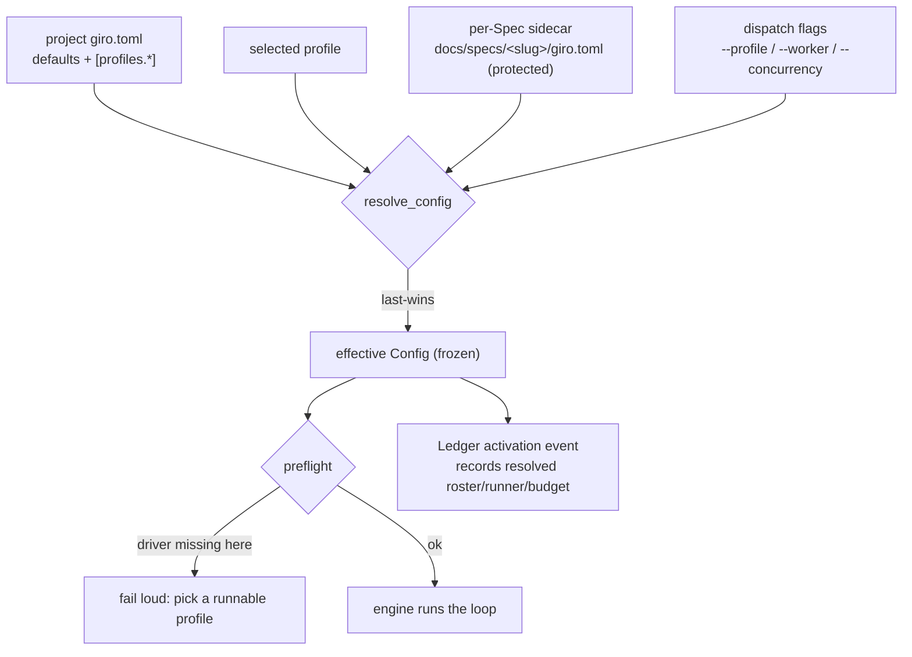

# Per Spec Roster

## Problem Statement

The "who and how" of a build — roster, runner, budget — lives in one project-wide `giro.toml` read once per Run, so every Spec is built by the same agents at the same settings. An operator cannot say "build this Spec fast with cursor, that one carefully with opus" without editing project config between dispatches, and the choice is recorded nowhere, so a finished Run can't be explained by what actually built it.

## Solution

The build config becomes layered and per-Spec. Named **Profiles** in `giro.toml`, a per-Spec sidecar `docs/specs/<slug>/giro.toml`, and dispatch-time flags resolve last-wins into one effective config, chosen live from chat. That config is frozen at Run start, validated against the environment by preflight, and recorded in the Ledger — no mid-run fallback, so a Run stays reproducible and never silently swaps a model.

## User Stories

1. As an operator, I want named profiles (e.g. `fast`, `careful`) in `giro.toml`, so I can pick a bundle of roster + runner + budget by name.
2. As an operator, I want a Spec to carry its own `giro.toml` sidecar that selects a profile or overrides pieces inline, so its build settings travel with it and outlive one dispatch.
3. As an operator, I want to override the roster live at dispatch (`giro implement <slug> --profile fast --worker cursor`), so I can adapt to what's installed and my quota right now without editing files.
4. As an operator driving from chat, I want to say "implement auth-spec with cursor using model X" and have the `giro` console record that selection and dispatch, so expressing a preference is a sentence.
5. As an operator, I want the effective config frozen at Run start and recorded in the Ledger, so I can read afterwards exactly which driver, model, and settings built the work.
6. As an operator, I want a Spec that names a driver absent in this environment to fail preflight loudly, so I get "pick a runnable profile" rather than a silent substitution.
7. As a security-conscious operator, I want the per-Spec sidecar to be a protected path a worker cannot edit, so a worker can't rewrite the config that picks the judge grading it.

## Shape



## Implementation Decisions

- `[profiles.<name>]` bundles roster + runner + budget overrides; a per-Spec sidecar selects one and/or overrides fields inline, parsed by the same parser as the project file:

  ```toml
  # project giro.toml
  [profiles.fast]
  concurrency = 3
  [profiles.fast.roster]
  worker = { driver = "cursor", model = "grok-4.6", args = ["--force"] }

  # docs/specs/auth/giro.toml  (the sidecar)
  profile = "fast"
  [runner.roster]
  judge = { driver = "claude", model = "opus" }   # override one piece of the profile
  ```

- A new pure `resolve_config(root, slug, overrides) -> Config` composes project defaults → selected profile → sidecar → dispatch overrides, last-wins and field-level for roster entries. `load_config` stays the single-file parse; `resolve_config` layers on top, and downstream (`_build_engine`, the loops) still consumes one immutable `Config`, never learning it was layered. With `slug` absent (e.g. `giro status`), only project defaults resolve.
- The sidecar is read from the same place as the Spec body — the branch tip / worktree via `SpecView` (ADR-0013) — so it activates and travels with the Spec, not the invoking checkout.
- Selection is by driver **name**, resolved through the Driver registry (the `open-drivers` Spec); a sidecar never inlines a recipe.
- The sidecar joins the worker protected-path set: an attempt editing `docs/specs/<slug>/giro.toml` is reverted and refused, exactly as for `giro.toml`.
- `giro implement` gains `--profile`, `--worker`, `--concurrency` — the ephemeral top layer; nothing from a flag is persisted.
- Preflight resolves, validates against the environment, and freezes the effective config before the loop; a name the registry can't resolve here fails loud (ADR-0017). Quota or driver death mid-Run stays a fail-closed escalation, unchanged.
- The Ledger `activation` event carries the resolved config; this bumps the events schema and adds the fields to the docs/design.md *Events* table (the doc-drift test binds the pair):

  ```json
  { "type": "activation", "spec": "auth", "branch": "giro/auth", "base_branch": "main",
    "config": { "roster": { "worker": {"driver": "cursor", "model": "grok-4.6"} },
                "concurrency": 3, "issue_attempts": 3, "validate_cycles": 1 } }
  ```

- The `giro` skill turns a chat preference into a sidecar write or a dispatch flag, suggesting installed options but accepting any; an unknown driver is handed to `giro-setup` first.

## Testing Decisions

- `resolve_config` is the dominant seam — table-drive precedence and partial-override in `test_config.py` beside `test_roster_fallback_inherits_driver_and_model_but_not_args`: a profile sets worker=cursor, a sidecar overrides the judge only, a flag overrides concurrency; assert the composed Config and that unset layers inherit.
- Loud-unknown-driver-at-preflight extends `test_doctor_missing_driver_fails`; freeze is observable because resolution happens once and the engine holds an immutable Config.
- Sidecar-as-protected-path joins `test_worker_editing_protected_paths_is_refused` in `test_loops.py`.
- The Ledger recording is pinned by the events doc-drift seam — `test_events_subsection_names_every_event_and_field_a_happy_path_emits` and `test_events_subsection_documents_every_known_event_type` — so an undocumented `config` field fails the test.

## Docs Impact

- `docs/design.md` — *Configuration* gains `[profiles.*]`, the sidecar, and the resolution order; the *Runs → Events* subsection documents the `activation` event's new `config` fields; the protected-paths corollary adds the sidecar; ADR-0017 joins the *Decisions* list.
- `README.md` — the config/quickstart shows a profile and a dispatch-time override; the "one giro.toml" framing becomes "layered, per-Spec".
- `config.py` `INIT_TEMPLATE` — add a commented `[profiles.*]` example and a pointer to the sidecar.

## Out of Scope

- The open-driver recipe + registry itself — the `open-drivers` Spec; this Spec selects among whatever the registry resolves.
- Mid-run fallback across drivers/models on quota exhaustion — rejected (ADR-0017); exhaustion stays a fail-closed escalation.
- Adaptive auto-selection of a profile from live quota state; preflight only checks presence/runnability, the operator picks.
- Persisting a dispatch flag back into the sidecar.
