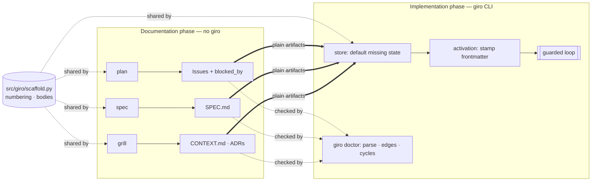

# Standalone authoring skills

## Problem Statement

giro fuses two phases into one tool. The *documentation phase* — interviewing intent, writing ADRs and `CONTEXT.md`, capturing Specs, slicing Issues — is valuable on its own, but today its skills (`giro-spec`, `giro-plan`, `giro-grill`) are giro-branded and lean on the CLI (`giro new`, `giro implement`) to be useful. Someone who just wants a disciplined spec-writing method cannot adopt it without buying the whole engine, and the *implementation phase* (the strict, deterministic loop) cannot be kept cleanly separate.

## Solution

Split the two phases at the **activation line** (the `draft → active` transition). Upstream of it, `grill`/`spec`/`plan` become generic, unprefixed skills adapted from Matt Pocock — they carry their own templates and numbering and write **plain** artifacts (no lifecycle frontmatter), so they install and run with no giro at all. Downstream, the engine ingests those plain artifacts: it defaults a missing `state:` on read and stamps the real frontmatter at activation, keeping state its own property, and `giro doctor` reads every artifact the engine's way so a malformed one never reaches a Run.

## User Stories

1. As a developer with no giro install, I want to copy the `spec` skill into my chat host and get a well-formed `docs/specs/<slug>/SPEC.md`, so I can adopt the method without the engine.
2. As a developer, I want `grill` and `plan` to write `CONTEXT.md`, ADRs, and Issues with correct numbering by inspection, so the artifacts are the same with or without giro.
3. As a giro operator, I want the engine to pick up a hand-authored plain Spec and Issue and stamp their state as it runs, so the two phases join seamlessly at the activation line.
4. As a giro operator, I want `giro doctor` to reject a malformed or cyclic artifact before a Run, so tolerance of *absent* frontmatter never becomes tolerance of garbage.
5. As a maintainer, I want one dependency-free home for numbering and starter bodies that both `giro new` and the skills rely on, so the two authoring paths cannot drift.

## Shape

## Implementation Decisions

- **`src/giro/scaffold.py`** — new stdlib-only module (no other giro imports): `slugify`, starter bodies (`SPEC_BODY`/`ISSUE_BODY`/`ADR_BODY`), numbering (`issue_id`, `adr_filename`), and `write_adr`. `Store` and `giro new` build on it; the skills mirror its templates and number by inspection.
- **Tolerant reading** (`store.py`) — `_parse_frontmatter` returns `({}, text)` when there is no frontmatter zone; `parse_spec`/`parse_issue` default a missing/empty `state` to `SPEC_INITIAL`/`ISSUE_INITIAL` (`states.py`). A *present but invalid* state still raises.
- **Engine stays the state writer** — activation (`loops.py`) already calls `save_spec`, which writes the full frontmatter; no new stamping path is needed.
- **`giro doctor` specs section** (`cli.py: _doctor_specs`) — loads every Spec and its Issues via `SpecView`, checks `blocked_by` resolves and `_first_cycle` finds no cycle; a "must" check.
- **Rename** — `skills/giro-{spec,plan,grill}` → `skills/{spec,plan,grill}`; content stripped of engine vocabulary; each credits its Matt Pocock lineage. `giro`/`giro-setup` stay CLI-bound.

## Testing Decisions

External behaviour, via `tests/test_authoring_skills.py`: the skills are unprefixed and name no hard giro dependency; the scaffold writes plain numbered artifacts; a plain Spec/Issue reads at its initial state; `giro doctor` flags dangling edges, invalid state, and cycles; and end-to-end, the engine ingests a hand-authored plain Spec and stamps it to `done`. Existing `giro new`/store/prompts/doctor tests stay green (the `giro new` path is unchanged).

## Docs Impact

- `README.md` — quickstart, the two-phase framing, the skills list (engine vs. authoring), the Pocock credit, a new roadmap milestone.
- `docs/design.md` — the figure alt text, the M4 note, and a new M9 milestone.
- `CONTEXT.md` — the **Skill** term, plus a new **Authoring skill** term.
- `skills/README.md` — new: the standalone-install story.
- `CHANGELOG.md` — an Unreleased section.
- ADRs — 0018 (authoring skills are giro-independent), 0019 (state frontmatter is engine-only); 0009 annotated.

## Out of Scope

- Splitting the authoring skills into their own git repository (kept in-repo, single source; the wheel re-bundles them). Revisit if external adoption warrants.
- Regenerating the SVG figures that still show the old `giro-`prefixed skill names (alt text updated; images are a follow-up).
- Any change to the engine's own `giro new` output (still framed) or to the loop, gates, or projection.
